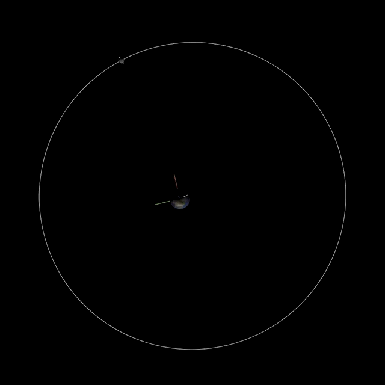

# AstroPlayground

A React.js app backed by an Elixir/Phoenix/PostgreSQL backend. Experimental
WebGL rendering done with Three.js.

Ever wondered what the moon looks like as it orbits around the Earth? What about Jupiter and its moons? If so, you are not alone. I have been wanting to put something like this together for a long time, and the time has finally come. I took a short online course on 3d graphics (which included three.js code snippets), studied a few chapters in "Fundamentals of Astrodynamics" to learn about orbital motion, and put all of my learnings together in this demo (which is still in progress!). See instructions below to see the demo(s) for yourself!

## Prerequisites

To get started, you need to install Elixir and Phoenix. They do a better job at explaining [installation](https://hexdocs.pm/phoenix/installation.html#content) than I could.

Once installed, be sure to install front-end deps with `npm install`. I have been using the latest 10.x version of node. Also, you need postgresql. See `config.dev.exs` for default credentials.

To start your Phoenix server:

  * Install dependencies with `mix deps.get`
  * Create and migrate your database with `mix ecto.create && mix ecto.migrate`
  * If you don't see the seed data get inserted to the database, you can always run `mix ecto.reset` to be sure everything is as it should be.
  * Start Phoenix server with `mix phx.server`

Now you can visit [`localhost:4000`](http://localhost:4000) from your browser. Since this was just a proof-of-concept demo, the site itself isn't very flashy. Click the "Heavenly Bodies" link to see a table of available bodies. Click on the name of any body to see the WebGL representation of it and any satellites (orbiting bodies) it may have.

It is important to know that not every body in the system has a map texture. There are some satellites that space agencies just haven't had the resources/time/priority to map. These bodies will just show up as bland spheres, but their relative sizes and orbit shapes should be intact.

## Data Origin

When I started, I was able to hunt down some [fact sheets](https://nssdc.gsfc.nasa.gov/planetary/planetfact.html) from NASA and manually used that data for the database seeds. I realized I needed more and ended up with a telnet connection (yea, telnet!) to JPL's [HORIZONS](https://ssd.jpl.nasa.gov/?horizons) system. I was then able to find a node.js [telnet library](https://www.npmjs.com/package/expect-telnet) that automatically combs specific bodies for their orbital elements, which I can then use in the app to calculate orbital motion given a specific time. I really wish there was a collection of REST endpoints for this system, but after interacting in telnet, I can see why they have made the decision to stick with telnet. It's a good thing that interaction can still be automated!

## Notes on Scale

Scaling has been one of the biggest challenges on this project and will continue to be. Since I have included the Sun as a body and all of the solar system planets (I even threw Pluto in there because it had a texture map!), it became immediately apparent that scale would be an issue.

### Body Size

If the Sun were the size of a golf ball, then the Earth would be a grain of sand. These proportions just won't cut it for the purposes of this demo. So planets around a star will be a bit bigger than they actually are compared to the rendered star, so you can actually see them.

### Orbit Size

The orbit sizes also need some scale applied. The actual proportions mean that a golf-ball-sized Sun would see Pluto many football fields away. I didn't want to be scrolling forever so the orbits also needed some scale. For the most part, they are proportional to each other, but are scaled at a different ratio than the bodies themselves.

### Time

Does anyone really have a year to watch Earth move around the sun in a simulation? I sure don't. Time needed to be sped up a bit so the viewer can actually see movement. This means that time is moving quite a bit faster than we humans experience, but it makes watching multiple orbits around a body much more interesting to see.

## Other Considerations

As I previously mentioned, this is a work in progress. It still has some kinks as well as some missing features. Here are a few things I'm aware of and trying to fix/add:

- oblateness is known from the data, but is yet to be implemented
- orbits are with one body around another, where it might be more accurate to have bodies orbiting around a common barycenter
- controls for the scene have yet to be implemented (so users can play with scale, time, etc. in real time)
- labels and diagrams for the orbit ellipticals, as well as body information, should be accessible in the scene
- might be nice to get a visual of the position and velocity vectors of an orbiting body, while it's orbiting
- the scaling is currently linear, but looking into non-linear functions to define scale transformations
- camera controls are needed to help navigate a scene. currently the camera focus stays on the chosen, central body even if it has satellites.
- lighting and scales need to change when a star is the central body
- probably much more...

## Sneak Peek

Captured at 23fps. Looks much smoother running the app locally.  =]

