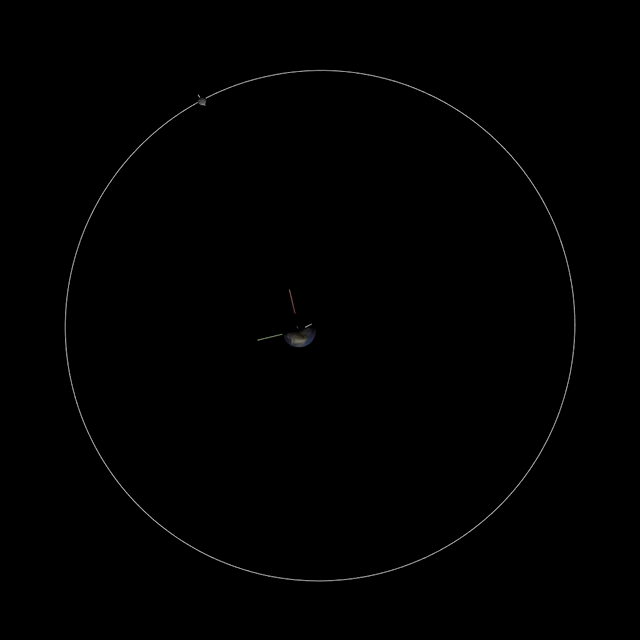

# AstroPlayground

A real-time visualizer of the solar system, rendered in WebGL from **real NAIF
SPICE ephemerides** — the same trajectory data NASA/JPL uses to fly spacecraft.
Watch the Moon wobble around the Earth–Moon barycenter, the Galilean moons whip
around Jupiter, or Nereid trace its wildly eccentric path around Neptune — every
orbit computed from actual state vectors, not faked with a circle.



> Ever wondered what the Moon looks like as it orbits the Earth? What about
> Jupiter and its moons? So did I. This started as a way to put a short 3D-graphics
> course, a few chapters of *Fundamentals of Astrodynamics*, and a lot of
> curiosity together in one place. It's still a playground — a work in progress.

## What you can see

- **System views** — a body and everything orbiting it, animated on real orbital
  motion: **Earth–Moon**, **Mars** (Phobos, Deimos), **Jupiter** (Galileans +
  inner moons), **Uranus** (Ariel, Umbriel, Titania, Oberon, Miranda), **Neptune**
  (Triton, Nereid), and **Pluto** (Charon + Nix/Hydra/Kerberos/Styx).
- **Single-body views** — a textured, correctly tilted and rotating sphere for
  any body, with an info panel (size, mass, tilt, rotation, texture provenance).
- **Real motion, honestly rendered** — orbits are sampled from SPICE and *precess*
  (they don't close), so bodies leave a **fading trail** rather than riding a fake
  loop. An opt-in **best-fit ellipse guide** shows how far the real path drifts
  from an ideal ellipse — perturbations, made visible.
- **Controls** — adjustable time scale, **follow** any body, toggle findability
  **markers** (true-scale bodies can be single-pixel specks), and the ellipse guide.

Everything is rendered at **true proportions** — see [On scale](#on-scale).

## Tech stack

| Layer | What |
|---|---|
| Backend | Elixir 1.18 · Phoenix 1.7 · Ecto 3 · Bandit — a JSON API |
| Ephemerides | Python `spiceypy` (CSPICE / NAIF SPICE toolkit), shelled out from Elixir |
| Frontend | React 18 · React Router 6 · three.js (r170) · Vite · lil-gui |
| Data | PostgreSQL 16 |
| Dev env | Fully containerized (Docker Compose) |

## Quickstart

Everything runs in Docker — no Elixir, Python, or Node toolchain needed on your host.

```bash
docker compose up                             # db + API (:4000) + SPA (:5173)
docker compose run --rm app mix ecto.setup    # one-time: create/migrate/seed
```

Then open **http://localhost:5173** and click **Heavenly Bodies** to browse.

> ⚠️ `mix ecto.setup` runs the seeds, which **download ~1.8 GB of NAIF kernels**
> (spacecraft-grade ephemeris files). This is a deliberate, one-time step — not
> something that runs on every boot. The kernels are git-ignored; you can delete
> `priv/kernels/` between sessions and re-fetch later.

Develop against the Vite dev server (`:5173`, with hot reload) — it proxies
`/api` to the Phoenix app.

## Data & accuracy

Body positions and orientations come from **NAIF SPICE** kernels (JPL DE432 for
planets, per-system satellite ephemerides, PCK orientation/radii). Orbits are
referenced to the **ecliptic** (`ECLIPJ2000`), so inclinations are correct
relative to Earth's orbital plane with no hand-tuned angles. Axial tilt and spin
come straight from the body-fixed frame orientation (Earth's 23.4°, Uranus on its
side at 82°, Venus's retrograde spin — all real).

Not every body has a surface texture — some moons simply haven't been mapped.
Those render as plain spheres, but their sizes and orbits are still accurate. When
a body lacks measured radii entirely, the app falls back to a nominal placeholder
size and says so in the info panel.

## On scale

Scale is the eternal challenge here. If the Sun were a golf ball, Earth would be a
grain of sand a few meters away — true proportions make bodies invisible. This app
currently renders **everything at true scale**: a system is framed so its largest
orbit fits the view, which means the bodies themselves are tiny (zoom in, or use
the markers to find them). The Earth–Moon barycenter correctly sits *inside* the
Earth; Nereid's orbit dwarfs Triton's because it really does.

A future "exaggerated scale" toggle — to inflate bodies for a legible, textbook-
style view of the whole solar system — is the next major milestone (see below).

## Project status

Revived from a 2018 proof-of-concept and actively evolving. Broad arc:

1. ✅ Findability markers for true-scale bodies
2. ✅ Moon systems wired for every planet with available ephemeris data
   *(Saturn's moons are not seeded yet)*
3. 🔜 **The Sun + all planets** — the finale, which forces the true-vs-exaggerated
   scale toggle

Planned work and known issues are tracked in **[GitHub Issues](../../issues)** —
API docs, kernel caching, UI polish, first-time-setup validation, and more.

## Repository layout

```
lib/                     Elixir — Phoenix API, Ecto schemas, SPICE bridge
priv/scripts/            Python spiceypy wrappers (trajectory, orientation, size)
priv/kernels/            NAIF SPICE kernels (git-ignored, fetched by seeds)
priv/repo/seeds.exs      Body/orbit/texture seeds + kernel download list
assets/js/               React SPA — routes, components, three.js models
docker-compose.yml       db + app + assets (+ textures tooling)
BODIES.md                Every seeded body, documented
CLAUDE.md                Architecture & dev deep-dive (start here to hack on it)
```

## Contributing / hacking

**[CLAUDE.md](CLAUDE.md)** is the developer's guide — architecture, the SPICE
pipeline, kernel management, how to verify renders, and the project conventions.
Read it before diving in.
